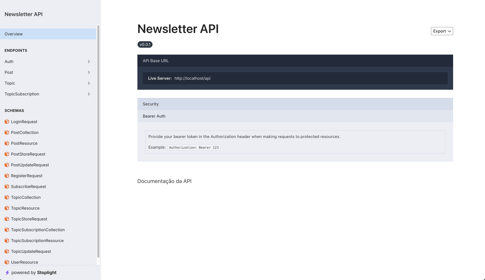
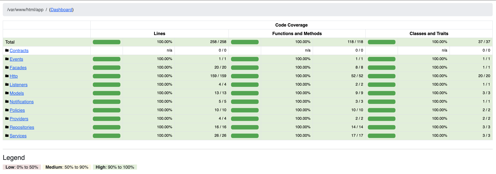

# Newsletter API

Projeto de API para gerenciamento de tópicos, publicações e envio de e-mails.

# 1. Instalação do projeto

## 1.1 Clonar repositório

Para iniciar o processo de instalação da aplicação, é necessário realizar o download do projeto. Para isso, faça clone da aplicação:

```sh
git clone https://github.com/fabriciosilvadev/newsletter-api.git
```

## 1.2 Instalar dependências

Agora, é necessário realizar a instalação das dependências através do Composer:

```sh
composer install
```

## 1.3 Configurar variáveis ambiente

É preciso configurar o arquivo com as variáveis de ambiente. Para isso, crie o arquivo `.env` a partir de uma cópia do arquivo `.env.example`:

```sh
cp .env.example .env
```

## 1.4 Atualizar `APP_SECRET`

Execute o seguinte comando para gerar um novo valor para `APP_SECRET`:

```sh
php artisan key:generate
```

# 2. Iniciando a aplicação

## 2.1 Inicializar API e serviços

Para iniciar a API e outras serviços dependentes, como o banco de dados, é disponibilizado uma configuração utilizando [Laravel Sail](https://laravel.com/docs/11.x/sail), útil para executar as ferramentas necessárias em ambiente de desenvolvimento. Para isso, execute o seguinte comando:

```
composer sail up
```

Ou para manter os serviços rodando em segundo plano:

```
composer sail up -d
```

> Algumas variáveis de conexão com o banco de dados e outras aplicações já estão pré-configuradas. Caso necessite conectar-se à outro banco de dados ou serviço SMTP, customize os dados de conexão no `.env`.

## 2.2 Criar tabelas e popular banco de dados

Na primeira execução da API, é necessário criar as tabelas do banco de dados e popular com dados iniciais para testes. Com os serviços em execução, rode os seguintes comandos:

```sh
composer sail artisan migrate
composer sail artisan db:seed
```

> Um usuário com permissão de administrador será criado com o e-mail `admin@admin.com` e senha `admin`.

Pronto, se tudo correr bem teremos:

-   API inicializada em `http://localhost`;
-   Mailpit dashboard inicializado em `http://localhost:8025`;
-   MySQL inicializado em `localhost:3306`.

# 3. Documentação

## 3.1 Documentação da API

Para documentar os endpoints disponíveis e suas respectivas funcionalidades, foi utilizado a ferramenta [Scramble](https://scramble.dedoc.co/).

Para acessar a documentação, acesse `http://localhost/docs/api`.

> É possível fazer download do arquivo contendo o Open API Spec clicando em "Export" -> "Original", na página "Overview".



## 3.2 Postman

Também foi disponibilizado uma collection e environment do [Postman](https://www.postman.com/). Importe os arquivos `Newsletter-API.postman_collection.json` e `Newsletter-Dev.postman_environment.json` presentes na raiz do projeto para ter acesso aos endpoints e exemplos de requisições.

# 4. Testes

## 4.1 Executar testes

Para executar a suíte de testes, execute o comando:

```sh
composer sail test
```

## 4.2 Cobertura de código

Também é possível obter um relatório de cobertura de código com o comando:

```sh
composer sail test -- --coverage
```

Para visualizar o relatório em HTML, execute:

```sh
composer sail test -- --coverage-html ./coverage
```

Será gerado um diretório `coverage` contendo um relatório em HTML com a cobertura de código.



# 5. Outras ferramentas

Outras ferramentas foram utilizadas para auxiliar no desenvolvimento do projeto:

-   [Larastan (PHPStan)](https://github.com/larastan/larastan): Análise estática de código;

-   [Laravel Pint](https://laravel.com/docs/11.x/pint): Corretor de estilo de código;

-   [PHP Insights](https://phpinsights.com/): Análise de qualidade de código.
